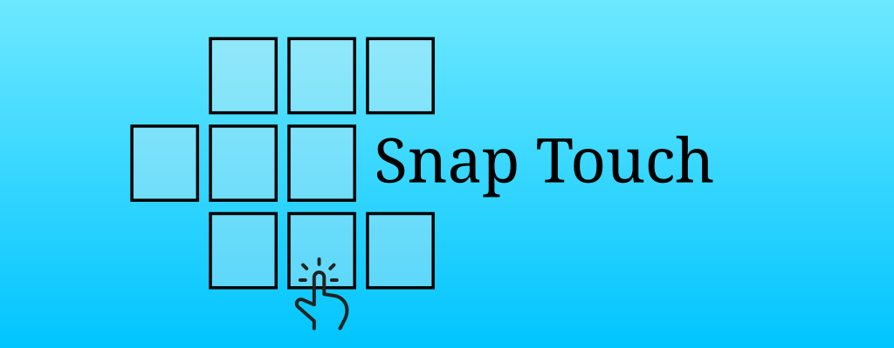

# Snap Touch

A touch enabled slider for horizontal navigation.
This slider calculates velocity to decelerate when flicked and will snap to an element when finished.

[View demo](https://jabes.github.io/snap-touch/)

### How To Use

Install with NPM

`npm install snap-touch --save`

Use a CDN

https://unpkg.com/snap-touch/snap-touch.js  
https://unpkg.com/snap-touch/snap-touch.min.js

### Features

- No dependencies
- Modern JavaScript (ES6)
- IE9+ compatible
- Responsive

### Example

```html
<div id="slider" class="slider">
    <div class="slides">
        <div class="slide"></div>
        <div class="slide"></div>
        <div class="slide"></div>
        <div class="slide"></div>
        <div class="slide"></div>
    </div>
</div>
```

```javascript
new SnapTouch('slider').create();
```

```css
.slider {
    overflow: hidden;
    padding-left: 50%;
    padding-right: 50%;
}

.slides {
    margin-left: -100px;
    margin-right: -100px;
    white-space: nowrap;
    font-size: 0;
}

.slide {
    display: inline-block;
    width: 200px;
    height: 200px;
    box-sizing: border-box;
    border: 2px solid white;
    background: black;
}
```

### Methods

| NAME           | PARAMETERS | TYPE     | DESCRIPTION                           |
|----------------|------------|----------|---------------------------------------|
| create         |            |          |                                       |
| destroy        |            |          |                                       |
| getActiveIndex |            |          |                                       |
| setActiveIndex | index      | (int)    | The index of the slide to activate.   |
| getGosition    |            |          |                                       |
| setPosition    | posX       | (number) | The slider position to set in pixels. |

##### Example:

```javascript
const slider = new SnapTouch('slider').create();
slider.setActiveIndex(2);
```

### Events

| NAME                         | PARAMETERS    | TYPE     | DESCRIPTION                                            |
|------------------------------|---------------|----------|--------------------------------------------------------|
| SnapTouch.created            |               |          |                                                        |
| SnapTouch.destroyed          |               |          |                                                        |
| SnapTouch.activeIndexChanged | index         | (int)    | The index of the current slide.                        |
| SnapTouch.trackingStart      |               |          |                                                        |
| SnapTouch.trackingEnd        |               |          |                                                        |
| SnapTouch.tracking           | now           | (number) | The time in milliseconds.                              |
|                              | timeElapsed   | (number) | Time elapsed since last tracking step in milliseconds. |
|                              | delta         | (number) | Difference between the last position and the current.  |
|                              | velocity      | (number) | The calculated velocity based on delta.                |
|                              | posX          | (number) | The current position in pixels.                        |
|                              | lastPosX      | (number) | The last tracking step position in pixels.             |
|                              | lastTimestamp | (number) | The last tracking step time in milliseconds.           |
| SnapTouch.positionChanged    | posX          | (number) | The current position in pixels.                        |
| SnapTouch.easePositionEnd    | posX          | (number) | The current position in pixels.                        |
| SnapTouch.resized            | slideWidth    | (number) | The width of an individual slide in pixels.            |
|                              | slideTotal    | (int)    | The total number of slides.                            |

##### Example:

```javascript
const slider = new SnapTouch('slider').create();
slider.addEventListener(
    'SnapTouch.positionChanged',
    function (event) {
        console.log('posX: ' + event.detail.posX);
    }
);
```
